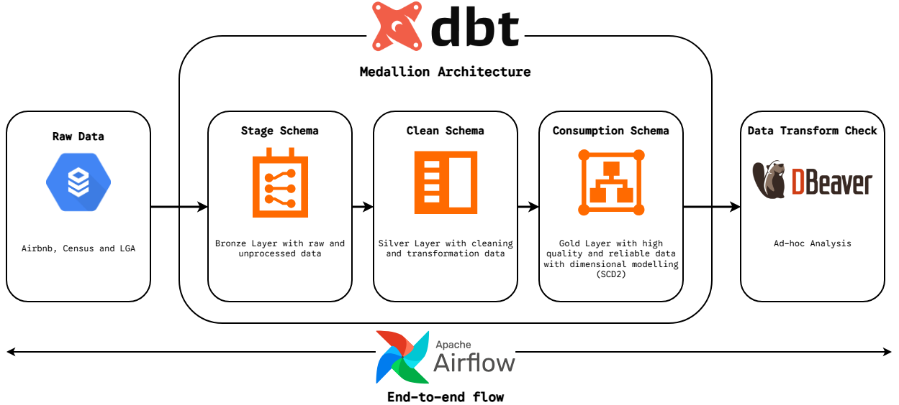

# Airbnb & Census ELT Warehouse


An end-to-end ELT pipeline for analysing Sydney Airbnb listings alongside Australian Census demographic data. The project uses Airflow for orchestration, PostgreSQL as the warehouse, and dbt to model the data through Bronze, Silver, and Gold layers.

This repository is maintained as a personal data engineering project: local-first, reproducible with Docker, and designed to grow into a portfolio-grade analytics platform with data quality checks, BI dashboards, and operational documentation.




## Overview

The warehouse combines monthly Airbnb listing extracts with ABS Census G01/G02 data and NSW LGA mapping files. It produces a dimensional model and analytics marts for rental-market performance, host concentration, neighbourhood demand, and mortgage-affordability analysis.

Core design choices:

- **Medallion architecture:** raw Bronze ingestion, cleaned Silver models, and Gold star-schema/reporting marts.
- **Idempotent ingestion:** bootstrap loads recreate the Bronze schema, while monthly listing files are appended chronologically.
- **Slowly changing dimensions:** dbt snapshots track history for hosts, properties, neighbourhoods, and LGAs.
- **Sequential monthly processing:** Airflow triggers dbt after each monthly load so snapshot validity remains aligned with the source timeline.

## Repository Structure

```text
.
|-- dags/
|   |-- airbnb_census_pipeline.py     # Main Airflow pipeline for initial and monthly loads
|   `-- initial_bronze_load.py        # Standalone Bronze bootstrap DAG
|-- dbt/
|   |-- models/
|   |   |-- bronze/                   # Source-facing raw models
|   |   |-- silver/                   # Cleaning, typing, deduplication, and bridge models
|   |   `-- gold/                     # Star schema and analytics marts
|   |-- snapshots/                    # SCD Type 2 snapshot definitions
|   `-- dbt_project.yml
|-- docker/                           # Local Airflow, dbt, and Postgres support files
|-- docs/
|   |-- 0_coding_standards.md
|   |-- 1_instructions.md
|   |-- 2_architecture.md
|   |-- 3_operations.md
|   |-- 4_roadmap.md
|   |-- architecture_flow.png
|   `-- airbnb_census_warehouse_report.pdf
|-- scripts/
|   `-- stage_at3_data.sh             # Unpacks source ZIP files into local data folders
|-- sql/
|   |-- init_bronze_schema.sql        # Warehouse schema bootstrap DDL
|   `-- analysis_queries.sql          # Business analysis query pack
|-- docker-compose.yml
|-- requirements.txt
`-- README.md
```

## Setup

Follow [docs/0_coding_standards.md](docs/0_coding_standards.md) before making code changes.

For local setup and run instructions, see [docs/1_instructions.md](docs/1_instructions.md).

For the project roadmap, see [docs/4_roadmap.md](docs/4_roadmap.md).

Prerequisites:

- Apache Airflow 2.x (local, Docker, or managed).
- PostgreSQL warehouse connection available to Airflow as `postgres`.
- dbt Core locally, or dbt Cloud if `DBT_RUN_MODE=cloud`.
- Raw data staged under a local data root with `airbnb`, `census/G01`, `census/G02`, and `mappings` subdirectories.
  - Default root is `/home/airflow/gcs/data` for compatibility.
  - Set `AIRFLOW_DATA_PATH` (env var or Airflow Variable) to run locally, e.g. `/opt/airbnb-data`.

Airflow variables used by the main pipeline:

- `RUN_INITIAL_LOAD`: set to `true` to run the bootstrap load before monthly processing. The legacy `RUN_PART1` variable is still supported as a fallback.
- `DBT_CLOUD_URL`: defaults to `cloud.getdbt.com`.
- `DBT_CLOUD_ACCOUNT_ID`
- `DBT_CLOUD_JOB_ID`
- `DBT_CLOUD_API_TOKEN`
- `DBT_CLOUD_WAIT_TIMEOUT_SEC`: defaults to `3600`.
- `AIRFLOW_DATA_PATH` (optional): filesystem root for input files and archives.
- `DBT_RUN_MODE`: use `local` for Docker/local dbt or `cloud` for dbt Cloud.
- `DBT_PROJECT_DIR`: local dbt project path when `DBT_RUN_MODE=local`.
- `DBT_PROFILES_DIR`: local dbt profile path when `DBT_RUN_MODE=local`.
- `DBT_LOCAL_COMMANDS`: local command sequence, defaults to `dbt build`.

Install Python dependencies:

```bash
pip install -r requirements.txt
```

## Local Airflow + dbt Setup (No Google Cloud)

The recommended local setup uses Docker Compose. It starts:

- PostgreSQL for both Airflow metadata and the analytics warehouse.
- Airflow webserver and scheduler.
- dbt Core inside the Airflow image.

### 1. Stage source data

Use the included helper to unpack the source ZIP files into `./data`:

```bash
./scripts/stage_at3_data.sh "/path/to/source-zips" data
```

Alternatively set `SOURCE_ARCHIVE_DIR`:

```bash
export SOURCE_ARCHIVE_DIR="/path/to/source-zips"
./scripts/stage_at3_data.sh
```

Expected folder structure:

- `data/airbnb/05_2020.csv` and `06_2020.csv`...`04_2021.csv`
- `data/census/G01/2016Census_G01_NSW_LGA.csv`
- `data/census/G02/2016Census_G02_NSW_LGA.csv`
- `data/mappings/NSW_LGA_CODE.csv`
- `data/mappings/NSW_LGA_SUBURB.csv`

### 2. Configure local environment

```bash
cp .env.example .env
```

On macOS/Linux, set `AIRFLOW_UID` to your local user id:

```bash
echo "AIRFLOW_UID=$(id -u)" >> .env
```

### 3. Start the stack

```bash
docker compose up airflow-init
docker compose up -d
```

Open Airflow at `http://localhost:8080`.

Default local login:

- username: `admin`
- password: `admin`

### 4. Run the pipeline

The Docker setup runs dbt locally with `DBT_RUN_MODE=local`, so no dbt Cloud credentials are required.

Trigger `airbnb_census_monthly_pipeline` with `RUN_INITIAL_LOAD=true`.

This path loads the baseline, runs dbt, then processes each monthly file in chronological order. The standalone `airbnb_census_initial_bronze_load` DAG is useful for Bronze-only testing, but it does not run the full dbt sequence.

For manual dbt checks inside the Airflow container:

```bash
docker compose exec airflow-scheduler bash
cd /opt/airflow/dbt
dbt build
```

To verify the latest pipeline run and key warehouse outputs:

```bash
./scripts/check_pipeline_outputs.sh
```

## Running The Pipeline

1. Deploy the contents of `dags/` to Airflow.
2. Deploy the dbt project in `dbt/` to dbt Cloud or your dbt runner.
3. Stage the source CSV files in `${AIRFLOW_DATA_PATH:-/home/airflow/gcs/data}` with folders:
   - `airbnb/`, `census/G01/`, `census/G02/`, `mappings/`
4. Trigger the `airbnb_census_monthly_pipeline` DAG.

The main DAG bootstraps the Bronze schema with `sql/init_bronze_schema.sql`, loads the May 2020 baseline data and reference files, runs dbt, then processes the remaining monthly Airbnb extracts in chronological order. Each monthly load appends to `bronze.airbnb_listings_raw`, triggers dbt, and archives the processed CSV.

## Data Model

- **Bronze:** raw CSV-aligned models for Airbnb listings, Census G01/G02, NSW LGA codes, and suburb mappings.
- **Silver:** cleaned listing records, normalized dimensions, and suburb-to-LGA bridge logic.
- **Snapshots:** SCD Type 2 history for host, property, neighbourhood, and LGA entities.
- **Gold:** monthly listing fact table, conformed dimensions, Census reference models, and data marts for host, listing-neighbourhood, and property-type performance.

## Analysis Queries

Run `sql/analysis_queries.sql` against the populated warehouse to answer:

- Which LGAs have the strongest and weakest revenue per active listing, and how do their demographics differ?
- How does median age correlate with revenue per active listing?
- Which property configurations perform best in the top revenue neighbourhoods?
- Are multi-listing hosts concentrated within a single LGA or distributed across several LGAs?
- How often can single-listing hosts cover annualized median mortgage repayments from Airbnb revenue?

## Notes

The project keeps raw Bronze fields as text for resilient ingestion and performs type casting in dbt. This makes source-file drift easier to isolate while keeping analytics models strongly typed.
